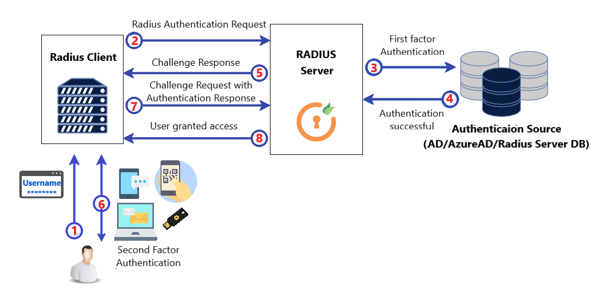

# Introduction
A Radius server is a network server that is responsible for managing user authentication, authorization, and accounting (AAA) for remote access servers such as VPNs, Wi-Fi hotspots, and network switches. 

The term RADIUS stands for Remote Authentication Dial-In User Service. It is an industry-standard protocol used by network administrators to centrally manage and secure access to network resources.

# Functionality:

A Radius server functions as a middleware between remote access servers and authentication servers. 

It manages user authentication and authorization by receiving access requests from remote access servers and forwarding them to authentication servers such as LDAP, Active Directory, or SQL databases. 

Upon receiving the access request, the Radius server authenticates the user by checking the user credentials against the authentication server's database. 

If the user is authenticated, the Radius server will authorize the user's access to network resources based on predefined policies and rules.





# Test

```powershell
docker compose up --build
```

```powershell
docker run -it --rm 2stacks/radtest radtest <email> <password> 127.0.0.1 0 secret
```